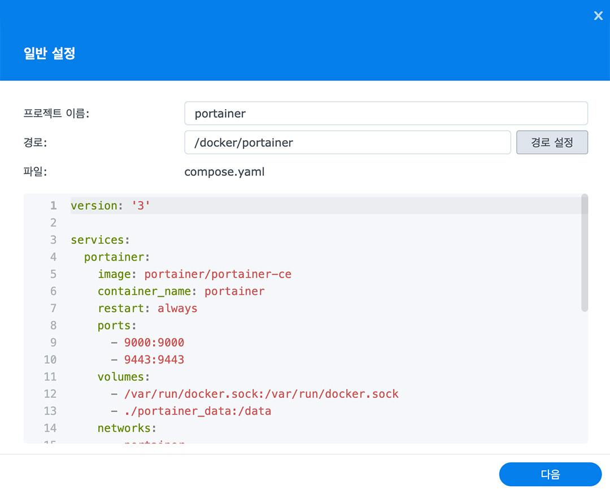

# Portainer with Container Manager

### Docker Compose
```yaml
version: '3'

services:
  portainer:
    image: portainer/portainer-ce
    container_name: portainer
    restart: always
    ports:
      - 9000:9000
      - 9443:9443
    volumes:
      - /var/run/docker.sock:/var/run/docker.sock
      - ./portainer_data:/data
    networks:
      - portainer

networks:
  portainer:
```

### Guide
> [!NOTE]  
> portainer는 단일 서비스로 만들어 사용할 수 있기 때문에 Container Manger의 '프로젝트' 탭에서 DockerCompose를 만들지 않고, '컨테이너' 탭에서 직접 컨테이너를 만들어도 좋습니다.

##### 1. Compose Up

1. Container Manager가 설치되어 있지 않다면, [패키지 센터] > [Container Manager]를 설치합니다.
2. Container Manager에서 [프로젝트]탭을 들어가 [생성]을 클릭합니다.
3. 위와 같이 적당한 프로젝트 이름, 경로를 입력합니다.
    - 이름은 portainer, 경로는 {PATH_OF_DOCKER}/portainer를 추천합니다.
    - 경로에 입력된 폴더는 미리 생성해두어야합니다.
4. 제공된 Docker Compose를 입력합니다.
5. [다음]을 클릭해 계속 진행합니다.
    - 이 단계에서 추가 설정은 필요 없습니다.

#### 2. First Sign In
// TODO