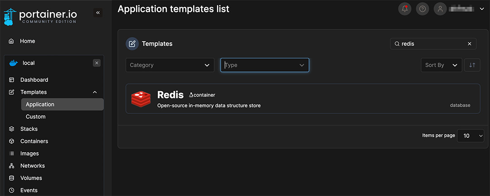
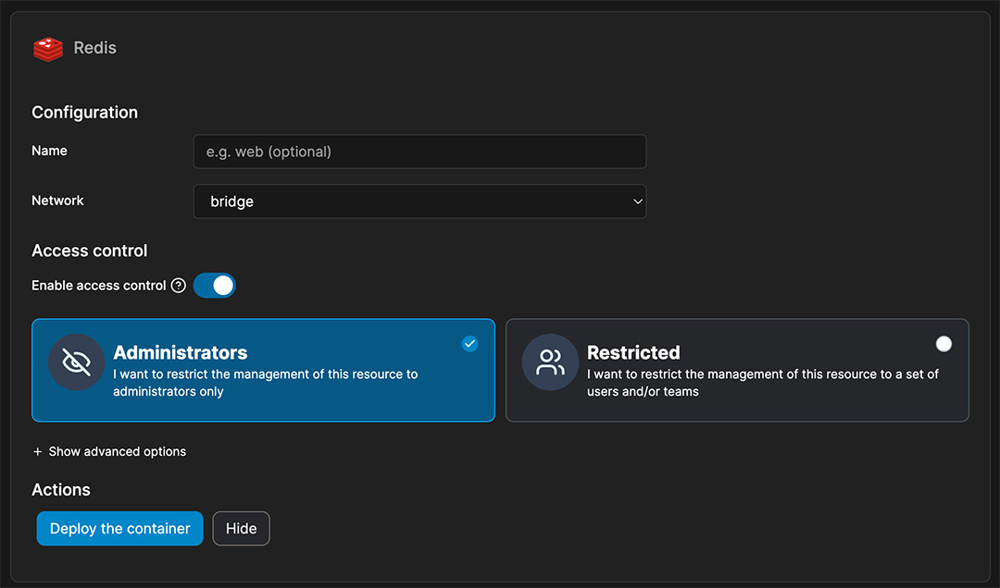

# Redis
> [!NOTE]  
> portainer를 설치했다면, [Templates]탭에서 공용 Redis를 손쉽게 설치할 수 있습니다.  
> Redis를 필요로하는 서비스는 보통 Compose에 전용 Redis를 따로 띄우기는 하지만 Compose File을 조금 수정하여 공용 Redis를 사용하도록 할 수도 있습니다.

### Template

1. Portainer의 [Templates] > [Application] 탭을 클릭합니다.
2. `Redis`를 검색합니다.
3. 검색 결과에 나온 Redis 템플릿을 클릭합니다.

1. 컨테이너의 이름을 지정하고 싶다면 [Name] 필드를 활용하세요.
2. 네트워크는 기본적으로 bridge가 사용됩니다.
    - 원하는 네트워크를 설정하되, 공용으로 사용하는 Redis일 경우 따로 네트워크를 만들어두는 편을 추천합니다.

### Docker Compose
// TODO